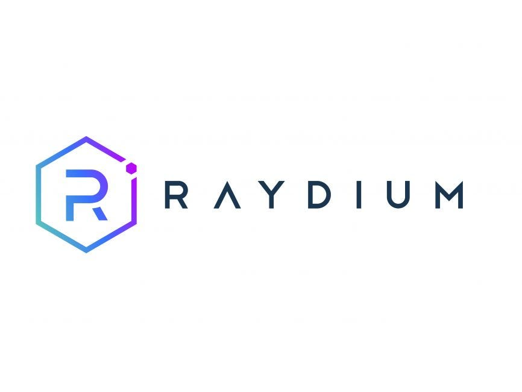

# Raydium Action Provider for CDP AgentKit



*submitted by teddynix as part of the Solana Cypherpunk Hackathon, Oct 2025*

This directory contains the **RaydiumActionProvider** implementation, which provides actions for AI agents to interact with **Raydium**, a leading automated market maker (AMM) and DEX on Solana.

## overview

Raydium is one of the largest and most liquid DEXs on Solana, offering things like:
- Fast and cheap token swaps
- Deep liquidity through its AMM protocol
- Integration with Serum's order book
- Over $1B in total value locked (TVL)

## directory structure

```
raydium/
├── raydiumActionProvider.ts         # Main provider with Raydium DEX functionality
├── raydiumActionProvider.test.ts    # Test file for Raydium provider
├── schemas.ts                       # Action schemas for all Raydium operations
├── index.ts                         # Main exports
└── README.md                        # This file
```

## actions

### `get_pools`
Get a list of available Raydium liquidity pools.

**Returns:**
- Pool pairs (e.g., SOL-USDC, RAY-USDC)
- Liquidity depth
- 24-hour volume
- APR (Annual Percentage Rate)

**Example Usage:**
```typescript
const pools = await agent.run("raydium_get_pools", { limit: 5 });
```

### `get_price`
Get the current price for a token pair on Raydium.

**Parameters:**
- `tokenAMint`: Mint address of the first token
- `tokenBMint`: Mint address of the second token

**Common Token Mints:**
- SOL: `So11111111111111111111111111111111111111112`
- USDC: `EPjFWdd5AufqSSqeM2qN1xzybapC8G4wEGGkZwyTDt1v`
- RAY: `4k3Dyjzvzp8eMZWUXbBCjEvwSkkk59S5iCNLY3QrkX6R`

**Example Usage:**
```typescript
const price = await agent.run("raydium_get_price", {
  tokenAMint: "So11111111111111111111111111111111111111112", // SOL
  tokenBMint: "EPjFWdd5AufqSSqeM2qN1xzybapC8G4wEGGkZwyTDt1v"  // USDC
});
```

### `swap`
Swap tokens using Raydium's AMM.

**Parameters:**
- `inputMint`: Mint address of the token to swap from
- `outputMint`: Mint address of the token to swap to
- `amount`: Amount of input tokens to swap
- `slippageBps`: Slippage tolerance in basis points (default: 50 = 0.5%)

**Example Usage:**
```typescript
const result = await agent.run("raydium_swap", {
  inputMint: "So11111111111111111111111111111111111111112",  // SOL
  outputMint: "EPjFWdd5AufqSSqeM2qN1xzybapC8G4wEGGkZwyTDt1v", // USDC
  amount: 1.0,
  slippageBps: 50  // 0.5% slippage
});
```

### `get_pool_info`
Get detailed information about a specific Raydium pool.

**Parameters:**
- `poolId`: The Raydium pool ID (public key)

**Returns:**
- Token reserves
- Trading fees (typically 0.25%)
- APR
- 24-hour volume and trade count
- Total Value Locked (TVL)

**Example Usage:**
```typescript
const poolInfo = await agent.run("raydium_get_pool_info", {
  poolId: "58oQChx4yWmvKdwLLZzBi4ChoCc2fqCUWBkwMihLYQo2"  // SOL-USDC pool
});
```

## network support

The Raydium provider supports **Solana mainnet only**.

For development and testing, consider:
- Using devnet testing (when Raydium devnet pools are available)
- Starting with small amounts on mainnet
- Using Jupiter for broader DEX aggregation

## adding new actions

To add new Raydium actions:

1. Define your action schema in `schemas.ts`
2. Implement the action method in `raydiumActionProvider.ts`
3. Add the `@CreateAction` decorator with proper description
4. Add tests in `raydiumActionProvider.test.ts`
5. Update this README

Potential future actions:
- Add/remove liquidity
- Stake LP tokens for farming
- Query user's pool positions
- Get historical price data
- Query pool APY/APR calculations

## dependencies

This action provider uses:
- `@solana/web3.js` - Solana blockchain interaction
- `@solana/spl-token` - SPL token operations
- `@raydium-io/raydium-sdk` - (planned) Full Raydium integration
- `zod` - Schema validation

## resources

- **Raydium Website**: https://raydium.io/
- **Raydium Docs**: https://docs.raydium.io/
- **Raydium SDK**: https://github.com/raydium-io/raydium-sdk
- **Raydium API**: https://api.raydium.io/v2/main/pairs